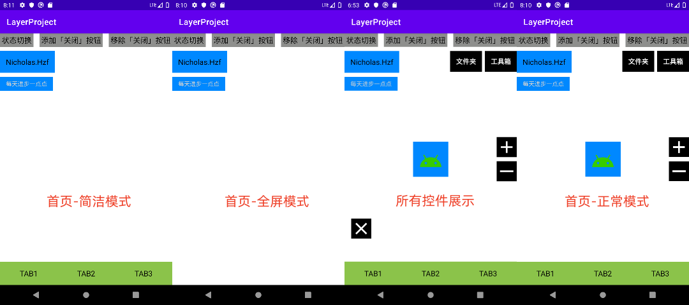

# LayoutVisibility
根据页面不同的状态，展示不同的界面布局的一种巧妙方案

开发应用的过程中，首页的控件越来越多，布局文件的代码已经到了爆表的程度，而且不同状态下首页各个控件的 Visibility 不同，每次新增状态都是一件头疼的事情，时常遗漏控件导致出错，和 YYY 大佬交流讨论后他给出了一种巧妙的方案，特此学习记录一下！
此处的多状态布局是指一个约束布局中，有很多的子布局和控件（Demo 中仅使用控件，嵌套子布局效果也是一样的），这些布局和控件根据首页状态的不同，各自的显示隐藏状态也不同，形成了不同的布局呈现。

# Demo 截图

# 博客介绍
https://blog.csdn.net/Nicholas1hzf/article/details/126320500?spm=1001.2014.3001.5502

# 方案简述
1. 需求是根据首页的状态不一样，触发不同的控件的隐藏显示状态的改变。
2. 可以考虑使用 0 和 1 来表示某个控件的隐藏显示，那么一个控件就可以使用一个 bit 来控制，0 表示隐藏 1 表示显示，多个控件的状态组合在一起成为了一串 0/1 二进制码。
3. 考虑到首页控件的数量 Demo 使用 Int 类型（Int 类型在 kotlin 中是 32 位，可以表示 32 个控件的可见性状态），如果控件数量过多则可以考虑使用 Long 类型。
4. 不同的 Int 值表示不同的首页状态，状态改变时更新当前状态的 Int 值，首页布局随之发生改变。